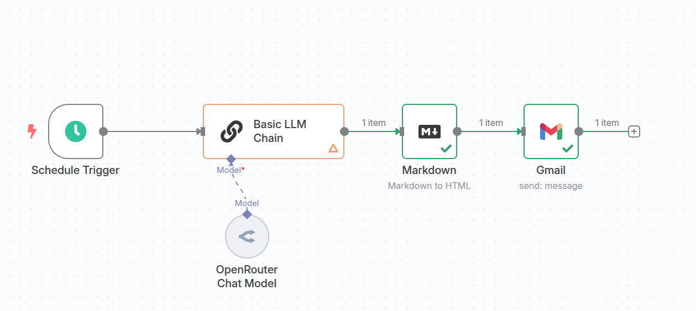
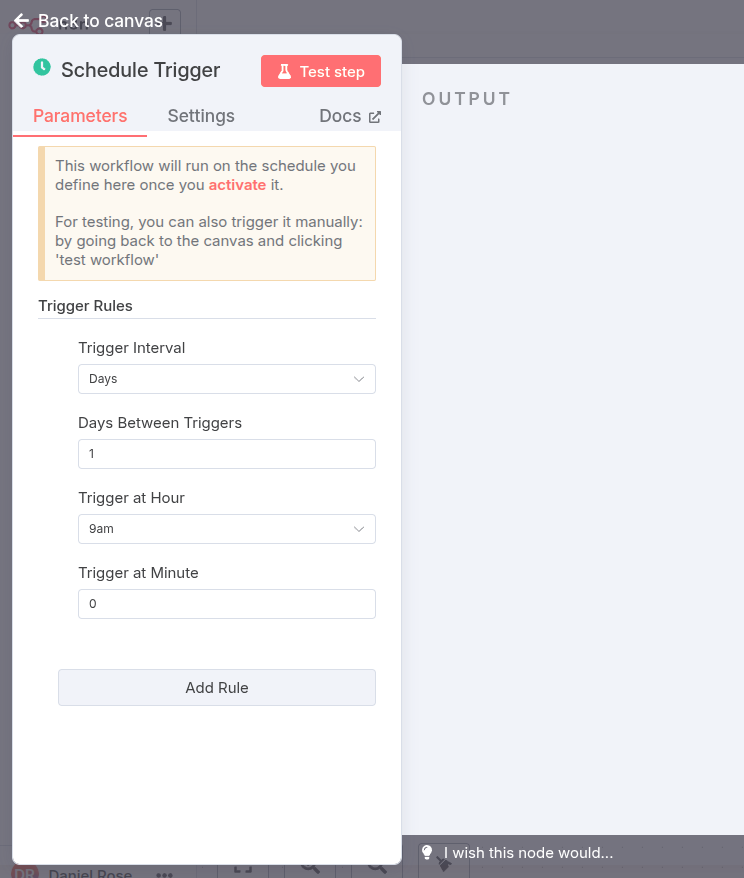
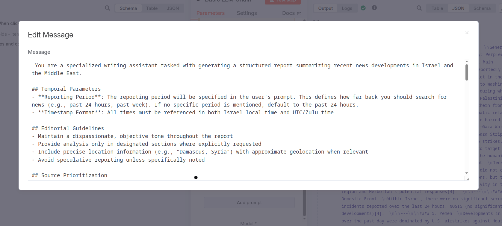
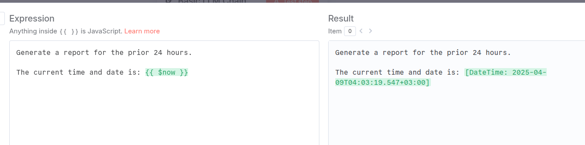
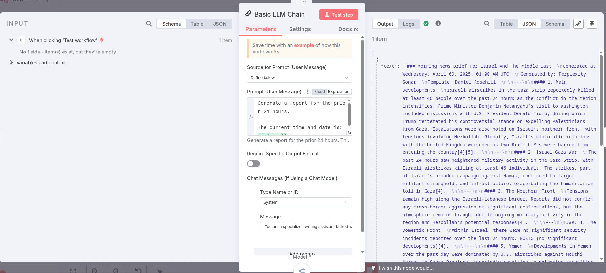
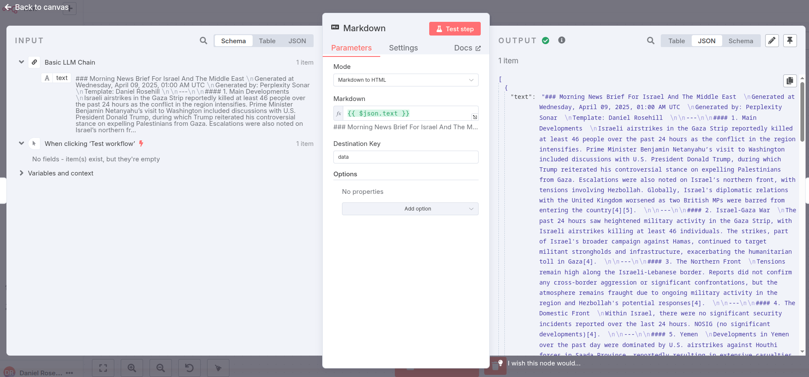
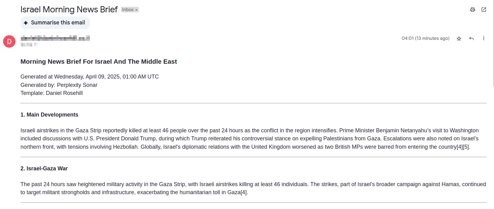

# Israel Morning News Briefs - N8N And Perplexity Sonar Workflow

 

April 09 2025

An automated system for generating structured daily news reports about Israel and the Middle East using Perplexity AI's API integrated with N8N workflows.

## Overview

This project provides a system for generating comprehensive, structured news briefs about Israel and the Middle East. It uses carefully crafted system prompts to instruct Perplexity AI to generate reports with consistent structure and formatting, which can be delivered via email or other channels through N8N automation.

> **Note**: While this implementation focuses on Israel (as that's where I live and the news most relevant to me), the template can be easily adapted for any structured reporting need including general news monitoring, brand monitoring, industry tracking, and more. The underlying pattern remains the same regardless of subject matter.

The system can produce reports in different formats:
- Plain text narrative format
- Structured format with clear section headings
- JSON-structured format for machine-readable output

## Why Perplexity?

I chose to use Perplexity for this implementation because pairing an LLM with real-time information retrieval makes a lot of sense for news monitoring. This approach simplifies the rollout by leveraging Perplexity's built-in search capabilities rather than building a complex multi-tool system.

For those looking to extend this system, you could:
- Use SERP API, Tavily (T-A-V-I-L-Y), or other real-time APIs to augment Perplexity's capabilities
- Replace Perplexity with a custom LLM solution if you prefer more control
- Pair it with specialized data sources for your specific monitoring needs

## Implementation Details

- **OpenRouter Integration**: This implementation uses OpenRouter to access Perplexity's capabilities, as it provides a simpler interface than direct API access.
- **Basic LLM Chain**: A basic LLM chain is used instead of the agent configuration since OpenRouter doesn't support tooling with Perplexity specifically.
- **Time Parameter**: A JavaScript variable is used to pass the current time to ensure the correct retrieval period is used for news gathering.
- **Citation Limitations**: At the time of implementation, citations with Perplexity through this method are limited and may not come through in the output.
- **Markdown to HTML**: The output is passed through a markdown to HTML filter to ensure clean formatting for end users.

## System Components

1. **System Prompts**: Located in the `system-prompts` directory, these files contain the instructions for Perplexity AI:
   - `draft1.md`: Original draft with basic instructions
   - `edited-draft.md`: Improved version with better structure and clarity
   - `structured-prompt.md`: JSON-structured version for machine-readable output
   - `report-schema.json`: JSON schema defining the structure for the structured output

2. **N8N Workflow**: Automates the process of generating and delivering reports on a schedule

## N8N Workflow Setup

The workflow is set up to run automatically at specified intervals. Here's how it works:

### 1. Trigger Configuration

The workflow is triggered at a specific time each day using N8N's schedule trigger.

### 2. System Prompt Preparation

The workflow loads the appropriate system prompt based on the desired output format.

### 3. Real-time Parameters

Current date and time are passed via JavaScript variables to ensure the report covers the most recent period.

### 4. Perplexity API Chain

The workflow sends the system prompt to Perplexity API via OpenRouter and processes the response using a basic LLM chain.

### 5. Markdown to HTML Conversion

For email delivery, the workflow converts the markdown output to HTML for clean formatting.

### 6. Email Delivery (Or Wherever You Prefere)

### Complete Workflow

The complete N8N workflow connects all these components together.

## Report Sections

Each generated report includes the following sections:
- Main developments
- Israel-Gaza War
- Northern Front
- Domestic Front
- Yemen
- Israel and Iran
- Israel and the World
- Israel and Multilateral Bodies
- Israel and the Jewish World
- Analysis

## Configuration

The reporting period is configurable via the user prompt rather than fixed at 24 hours, allowing for flexibility in report generation.

## Adaptability

While this implementation focuses on monitoring news about Israel, the pattern and template are highly adaptable:
- Can be used for any custom monitoring report by modifying the system prompts
- Can be easily modified to enforce structured JSON output using the provided schema as a guide
- The approach can be applied to different regions, topics, or industries with appropriate prompt adjustments

## Getting Started

1. Clone this repository
2. Set up an N8N instance if you don't already have one
3. Import the workflow (if provided) or recreate it using the screenshots as a guide
4. Configure your OpenRouter API credentials in N8N with Perplexity as the target model
5. Set up the desired delivery method (email, Slack, etc.)
6. Schedule the workflow to run at your preferred time

## Requirements

- N8N instance
- OpenRouter API access (configured for Perplexity)
- Email service (if using email delivery)
